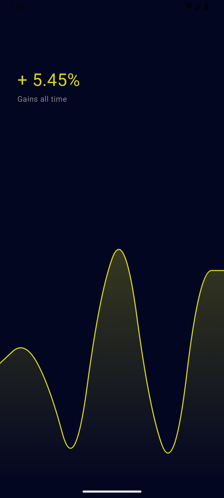
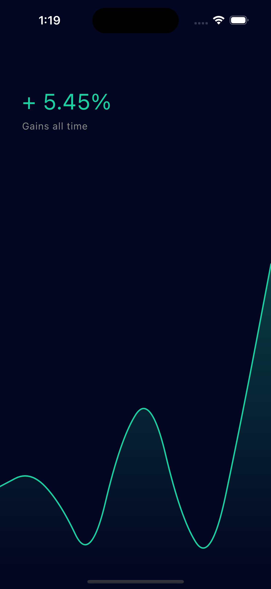
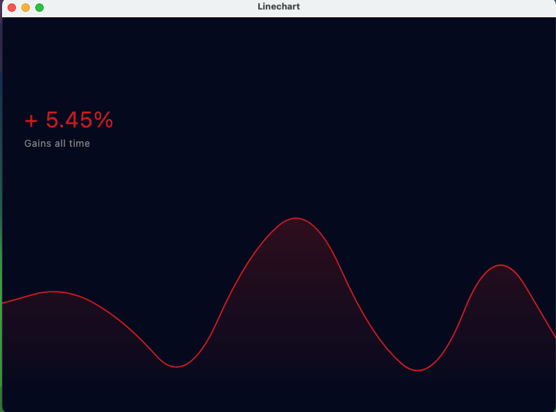

## LineChart for Compose Multiplatform

Simple, lightweight line chart components for Compose Multiplatform. Works on Android, iOS, and Desktop (JVM).

### Screenshots

Android



iOS



Desktop



### About

This library provides a customizable line chart Composable that you can embed in your Compose UI across platforms. See the `sample` module for usage examples.

### Installation (JitPack)

```kotlin
repositories {
    maven("https://jitpack.io")
}

dependencies {
    implementation("com.github.hossein-no1:compose-multiplatform-linechart:Tag")
}
```